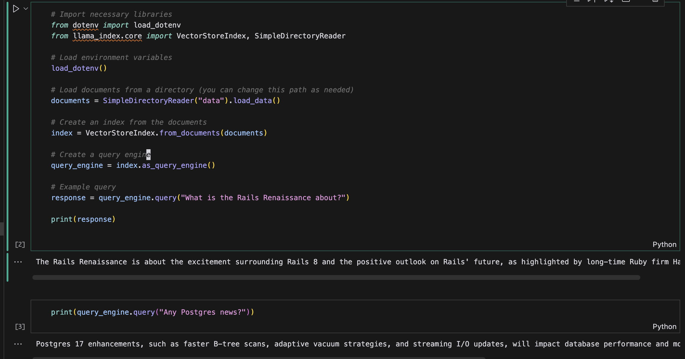
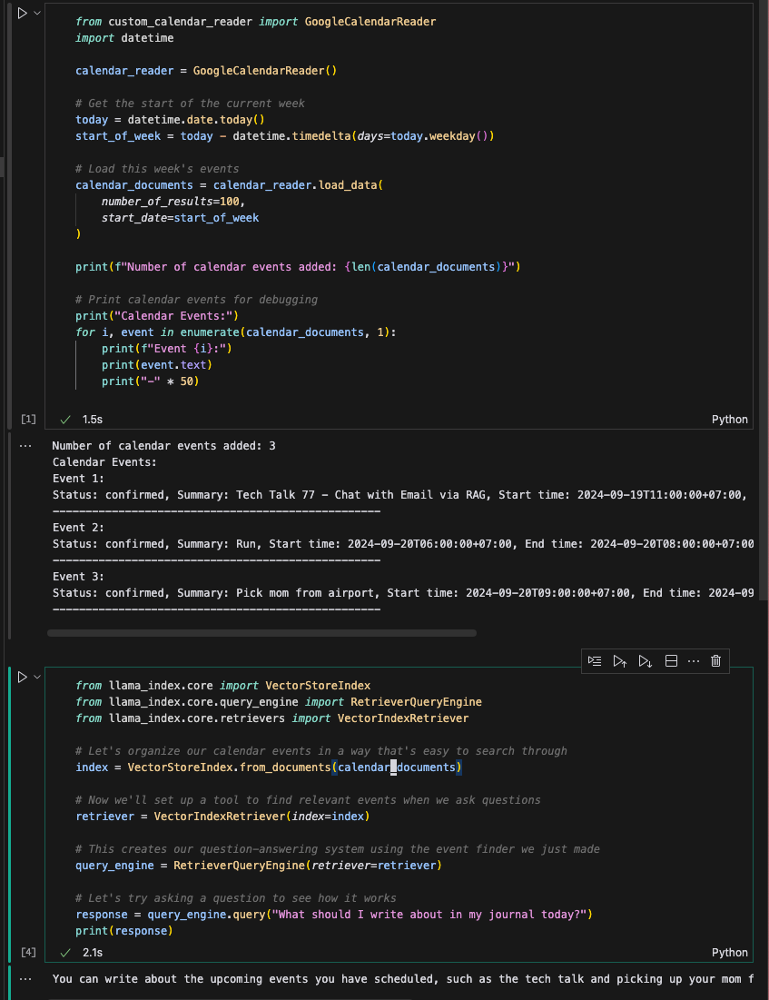

# README


## Set up

```
git clone git@github.com:harley/journal-with-LLM.git
cd journal-with-LLM
source .venv/bin/activate
```

- Add `credentials.json` to the root of the project (downloaded from Google Cloud Console)
- Add `.env` with OPENAI_API_KEY

## Chat with Email

To explore the Email RAG demo:

1. Open the [rag_email.ipynb](rag_email.ipynb) notebook in the current folder.
2. Follow the instructions within the notebook to run the demo.

This notebook demonstrates how to use RAG techniques with email data to enhance the capabilities of language models.




## Chat with Calendar

Similarly, to explore the Calendar RAG demo:

1. Open the [rag_calendar.ipynb](rag_calendar.ipynb) notebook in the current folder.
2. Follow the instructions within the notebook to run the demo.

This notebook demonstrates how to use RAG techniques with calendar data to enhance the capabilities of language models.

